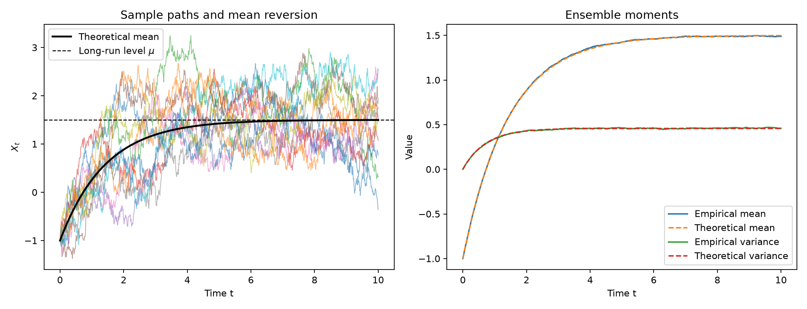
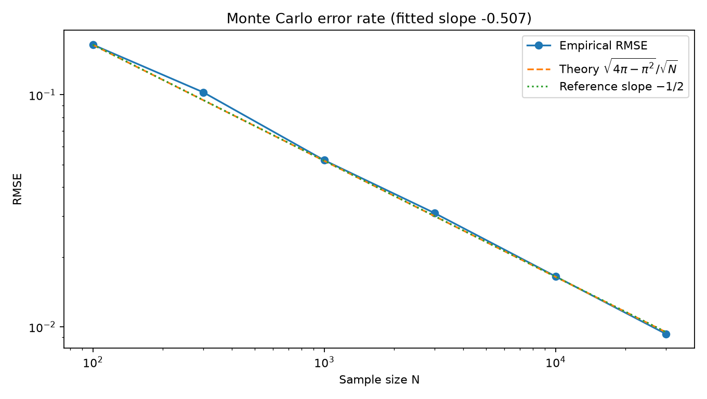
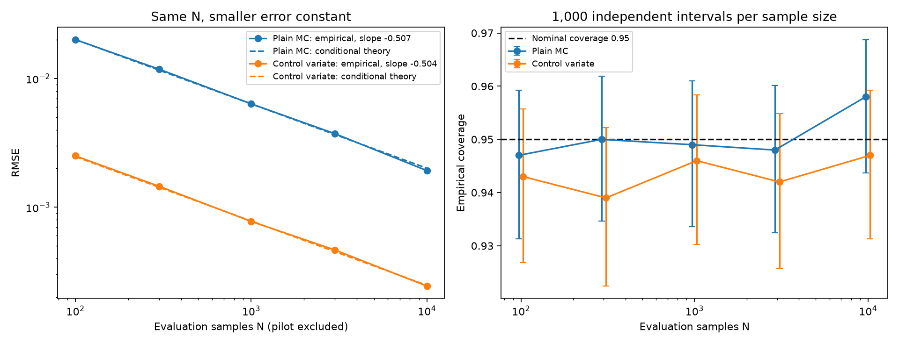

# Stochastic Processes Lab

[](https://github.com/Joao-Ray/stochastic-processes-lab/actions/workflows/tests.yml)
[](LICENSE)

Numerical experiments and visualizations for stochastic processes, probability, and Monte Carlo methods.

This undergraduate mathematics project connects **mathematical theory → numerical simulation → empirical verification**. All five core experiments are complete.

## Experiments

| Experiment | Main theoretical target | Notebook | Reusable code |
| --- | --- | --- | --- |
| Random Walk | $E[S_n]=0$, $\operatorname{Var}(S_n)=n$, first hitting times | [Open](notebooks/01_random_walk.ipynb) | [`random_walk.py`](src/random_walk.py) |
| Poisson Process | Poisson counts, exponential waiting times, independent increments | [Open](notebooks/02_poisson_process.ipynb) | [`poisson_process.py`](src/poisson_process.py) |
| Markov Chain | Matrix powers, stationary distributions, long-run occupancy | [Open](notebooks/03_markov_chain.ipynb) | [`markov_chain.py`](src/markov_chain.py) |
| Ornstein–Uhlenbeck Process | Mean reversion, stationarity, autocorrelation, half-life | [Open](notebooks/04_ornstein_uhlenbeck.ipynb) | [`ou_process.py`](src/ou_process.py) |
| Monte Carlo Methods | LLN, CLT, numerical integration, $N^{-1/2}$ error | [Open](notebooks/05_monte_carlo.ipynb) | [`monte_carlo.py`](src/monte_carlo.py) |
| Supplementary Validation | OU step bias, Markov mixing and periodicity, control variates and interval coverage | [Open](notebooks/06_supplementary_validation.ipynb) | Existing OU, Markov, and Monte Carlo modules |

Each notebook uses the same eight sections: Problem, Mathematical Background, Theoretical Result, Numerical Experiment, Visualization, Comparison with Theory, Interpretation, and Limitations. Experiments state the mathematical question, derive or cite the theoretical result, run a numerical simulation with a fixed random seed, and explain how the results compare with theory.

The [mathematical notes and review guide](notes/mathematical_notes.md) collects the main derivations, connects each formula to its implementation, and provides questions to answer before creating a release.

The implementation is separated from the presentation: notebooks explain and visualize the mathematics, `src/` contains reusable functions, and `tests/` checks theoretical identities, reproducibility, shapes, and invalid inputs.

## Random Walk results

At 100 steps, 10,000 simulated paths gave an endpoint mean of **0.046** and sample variance of **100.172**, compared with theoretical values **0** and **100**. For first hitting $+10$, 1,892 of 2,000 paths hit within 20,000 steps; the empirical median was 212 steps. The unfinished paths are right-censored, and the theoretical mean hitting time is infinite.


See also [moment convergence](figures/random_walk_moment_convergence.png) and [first hitting time](figures/random_walk_first_hitting_time.png). These figures were generated by running the notebook with its fixed seeds.

## Poisson Process results

For a process with rate $\lambda=2$, 10,000 simulated paths gave mean and sample variance **4.006** and **3.945** for $N(2)$, compared with the theoretical value **4** for both. The mean of 100,000 simulated waiting times was **0.4995**, compared with the theoretical value **0.5**. Counts on three disjoint intervals had empirical correlations between -0.003 and 0.001.


See also [sample paths](figures/poisson_process_sample_paths.png) and [independent increments and survival](figures/poisson_independent_increments_and_survival.png).

## Markov Chain results

For the weather transition matrix $P=((0.8,0.2),(0.4,0.6))$, the stationary distribution is **Sunny $=2/3$** and **Rainy $=1/3$**. Simulating 50,000 paths produced a one-step transition estimate of $((0.80014,0.19986),(0.39927,0.60073))$. A separate 50,001-state path spent **0.67089** of its time in the Sunny state.


See also [transition matrix powers](figures/markov_transition_powers.png) and [long-run occupancy](figures/markov_long_run_occupancy.png).

## Ornstein–Uhlenbeck Process results

For $\theta=0.7$, $\mu=1.5$, and $\sigma=0.8$, 8,000 Euler–Maruyama paths gave mean **1.4898** and variance **0.4589** at $t=10$, compared with theoretical values **1.4977** and **0.4571**. The theoretical mean-reversion half-life is **0.9902**; the empirical autocorrelation crossed 0.5 at lag **0.96**.



See also [stationary distribution and autocorrelation](figures/ou_stationary_distribution_and_acf.png) and [parameter effects](figures/ou_parameter_effects.png).

## Monte Carlo results

Using 1,000,000 uniform samples, the experiment estimated $\pi$ as **3.140864**, with absolute error **0.000729**. Across repeated experiments, the fitted log-log slope of RMSE against sample size was **-0.5074**, close to the theoretical Monte Carlo rate **-0.5**. For the CLT experiment, standardized estimates had empirical mean **0.0142** and variance **1.0132**. Monte Carlo integration estimated $\int_0^1 e^{-x^2}\,dx$ as **0.746684**, compared with the reference value **0.746824**.



See also [$\pi$ convergence](figures/monte_carlo_pi_convergence.png) and [the CLT and numerical integration](figures/monte_carlo_clt_and_integral.png).

## Supplementary experiments

The [supplementary notebook](notebooks/06_supplementary_validation.ipynb) tests numerical accuracy and assumptions using independent repetitions, reference methods, and a counterexample. It extends the five core experiments with three studies:

| Study | Design | Recorded result |
| --- | --- | --- |
| OU step refinement | Six steps from $1$ to $1/32$, exact Gaussian transitions versus Euler, 60,000 paths per combination | Euler's observed variance error relative to continuous theory fell from **53.64%** to **1.28%**. The analytic fine-step variance-bias slope was **1.024**. |
| Markov mixing | Three transition probabilities, both starting states, 50,000 paths per combination | Slow and fast mixing follow the eigenvalue formula. The periodic chain has a unique stationary distribution but stays at total variation distance **0.5**. |
| Monte Carlo control variate | Independent 5,000-point pilot, then 1,000 replications at each of five evaluation sample sizes | At $N=10,000$, plain and adjusted RMSE were **0.001925** and **0.000244**, about **7.9×** lower RMSE. Their 95% interval coverage was **95.8%** and **94.7%**. |

These comparisons report uncertainty as well as point estimates. Two of the twelve pointwise OU variance intervals miss their own method's theoretical variance; those runs are retained and discussed. Monte Carlo gains are measured at equal **evaluation** sample counts and exclude pilot cost. They are specific to this integrand, and both methods retain the $N^{-1/2}$ order.



See [OU refinement](figures/supplementary_ou_step_refinement.png), [Markov mixing](figures/supplementary_markov_mixing.png), the [study notes](notes/supplementary_experiments.md), and [parameters, seeds, versions, and full tables](notes/supplementary_results.json).

## Research subprojects

The [subproject directory](subprojects/README.md) extends the core experiments into focused studies with their own configuration, entry point, results, and report.

**[OU Calibration and Forecasting](subprojects/ou-calibration/README.md)** estimates OU parameters from synthetic time series and evaluates predictions on held-out futures. Six observation designs use 500 simulated paths each. Increasing record duration from 10 to 300 reduced the recorded mean-reversion-speed RMSE from **0.8464** to **0.0766**. At horizon 5, short-record plug-in intervals covered **85.4%** of future values; after a controlled mean shift, coverage for the $T=30,\Delta t=0.1$ model fell to **37.6%**. Fit failures and interval uncertainty are reported explicitly.

[Executed report](subprojects/ou-calibration/results/report.md) · [中文阅读指南](subprojects/ou-calibration/GUIDE_ZH.md)

```bash
python subprojects/ou-calibration/run.py
```

## Reproduce the experiments

Use Python 3.11 or newer. On macOS or Linux, create a virtual environment and install the dependencies:

```bash
python -m venv .venv
source .venv/bin/activate
python -m pip install -r requirements.txt
```

On Windows PowerShell, use:

```powershell
py -m venv .venv
.\.venv\Scripts\Activate.ps1
python -m pip install -r requirements.txt
```

Start Jupyter Lab, open a notebook, and run its cells from top to bottom:

```bash
jupyter lab
```

Run the complete test suite from the repository root:

```bash
python -m pytest -q
```

Execute and save the supplementary notebook from a fresh kernel without opening Jupyter:

```bash
python scripts/execute_notebooks.py notebooks/06_supplementary_validation.ipynb
```

Omit the notebook argument to execute all six notebooks. Execution regenerates the figures and numerical tables. The runner uses the Python environment from which it is invoked.

Fixed random seeds reproduce the reported runs. Small changes to a seed produce different individual samples while preserving the theoretical comparisons at a sufficiently large scale.

GitHub Actions runs the unit tests, executes the supplementary notebook, and reproduces the OU calibration subproject on Python 3.11, 3.13, and 3.14 after every push to `main` and for every pull request.

## Project layout

- `notebooks/`: explanations and visualizations
- `src/`: reusable simulation and analysis functions
- `tests/`: tests for important functions
- `figures/`: figures generated by executed notebooks
- `notes/`: mathematical notes and derivations
- `scripts/`: notebook execution tools
- `subprojects/`: focused research studies with configurations and executed reports
- `.github/workflows/`: automated test configuration

Dependencies for all experiments are listed in `requirements.txt`. Every notebook has been executed with fixed random seeds, and its reported numerical results and figures can be reproduced from the repository.
