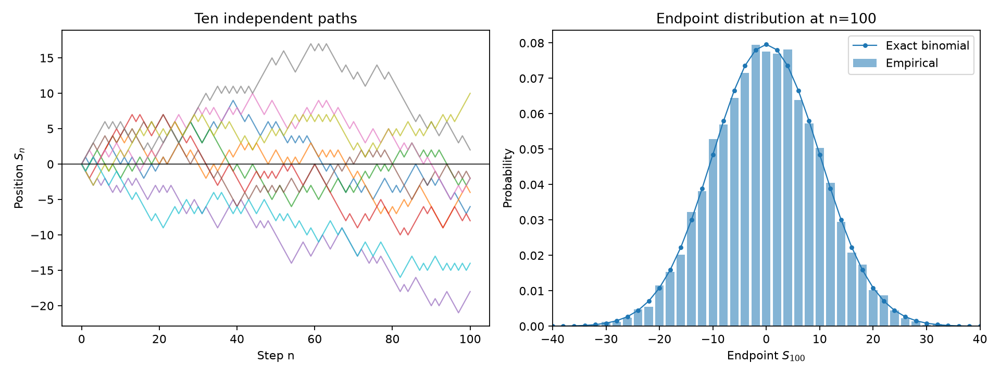
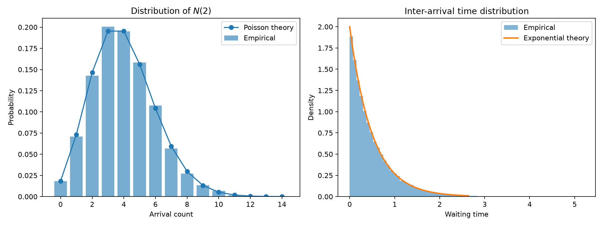
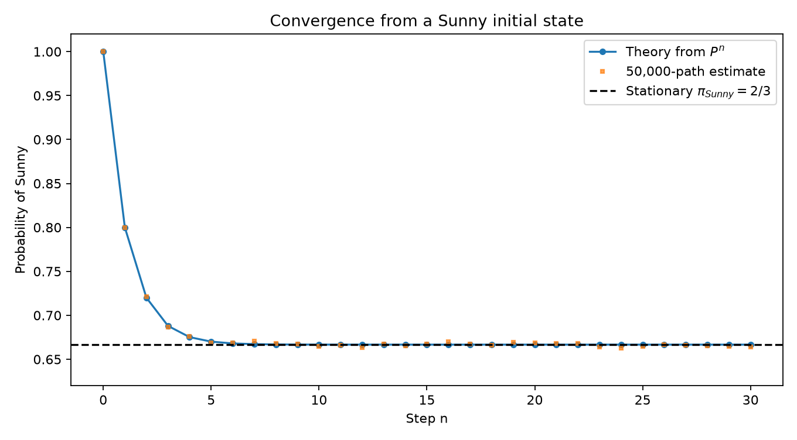

# Stochastic Processes Lab

Numerical experiments and visualizations for stochastic processes, probability, and Monte Carlo methods.

This undergraduate mathematics project connects **mathematical theory → numerical simulation → empirical verification**. The Random Walk, Poisson Process, and Markov Chain experiments are complete; the remaining experiments are reserved for later work.

## Planned experiments

1. [Random Walk](notebooks/01_random_walk.ipynb) — complete
2. [Poisson Process](notebooks/02_poisson_process.ipynb) — complete
3. [Markov Chain](notebooks/03_markov_chain.ipynb) — complete
4. [Ornstein–Uhlenbeck Process](notebooks/04_ornstein_uhlenbeck.ipynb) — planned
5. [Monte Carlo Methods](notebooks/05_monte_carlo.ipynb) — planned

Each notebook uses the same eight sections: Problem, Mathematical Background, Theoretical Result, Numerical Experiment, Visualization, Comparison with Theory, Interpretation, and Limitations. Experiments state the mathematical question, derive or cite the theoretical result, run a numerical simulation with a fixed random seed, and explain how the results compare with theory.

## Random Walk results

At 100 steps, 10,000 simulated paths gave an endpoint mean of **0.046** and sample variance of **100.172**, compared with theoretical values **0** and **100**. For first hitting $+10$, 1,892 of 2,000 paths hit within 20,000 steps; the empirical median was 212 steps. The unfinished paths are right-censored, and the theoretical mean hitting time is infinite.

See also [moment convergence](figures/random_walk_moment_convergence.png) and [first hitting time](figures/random_walk_first_hitting_time.png). These figures were generated by running the notebook with its fixed seeds.

## Poisson Process results

For a process with rate $\lambda=2$, 10,000 simulated paths gave mean and sample variance **4.006** and **3.945** for $N(2)$, compared with the theoretical value **4** for both. The mean of 100,000 simulated waiting times was **0.4995**, compared with the theoretical value **0.5**. Counts on three disjoint intervals had empirical correlations between -0.003 and 0.001.

See also [sample paths](figures/poisson_process_sample_paths.png) and [independent increments and survival](figures/poisson_independent_increments_and_survival.png).

## Markov Chain results

For the weather transition matrix $P=((0.8,0.2),(0.4,0.6))$, the stationary distribution is **Sunny $=2/3$** and **Rainy $=1/3$**. Simulating 50,000 paths produced a one-step transition estimate of $((0.80014,0.19986),(0.39927,0.60073))$. A separate 50,001-state path spent **0.67089** of its time in the Sunny state.

See also [transition matrix powers](figures/markov_transition_powers.png) and [long-run occupancy](figures/markov_long_run_occupancy.png).

To reproduce an experiment, install the packages in `requirements.txt`, open its notebook, and run the cells from top to bottom. Run tests with `pytest` from the repository root.

## Project layout

- `notebooks/`: explanations and visualizations
- `src/`: reusable simulation and analysis functions
- `tests/`: tests for important functions
- `figures/`: figures generated by executed notebooks
- `notes/`: mathematical notes and derivations

Dependencies for the current and later experiments are listed in `requirements.txt`. The two remaining notebooks contain only section headings and claim no results.
