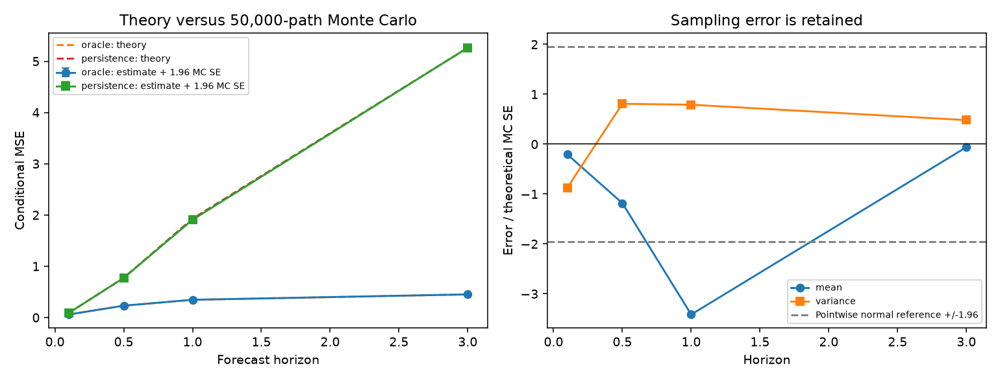

# OU Calibration and Forecasting

A runnable research subproject of [Stochastic Processes Lab](../../README.md).
It estimates OU parameters from synthetic observations, evaluates forecasts on
held-out futures, and tests the consequences of a change in the equilibrium mean.

[Executed report](results/report.md) · [Full numerical record](results/summary.json) ·
[Every parameter fit, including failures](results/replications.csv) ·
[中文阅读指南](GUIDE_ZH.md)

[Step-by-step theoretical derivations](THEORY.md) ·
[Executed numerical verification](results/verification/report.md) ·
[Verification data and tolerances](results/verification/results.json)

For confidence sets for the drift parameter, bias correction, and observation-
noise stress tests, see the related [OU Drift Inference Study](../ou-inference-study/README.md).
Its [working manuscript](../ou-inference-study/paper/MANUSCRIPT.md) reports
finite-sample calibration and failures separately from this forecasting study.

## 1. Problem

Given one equally spaced time series, can we recover the mean-reversion speed
$\theta$, equilibrium mean $\mu$, diffusion scale $\sigma$, and half-life?
How do record duration and sampling interval affect recovery? How well do
nominal 95% prediction intervals cover future observations when parameters are
estimated, and when the mean changes after training?

## 2. Mathematical Background

The OU SDE is $dX_t=\theta(\mu-X_t)dt+\sigma dW_t$. Its exact grid transition is

$$X_{k+1}=c+\phi X_k+\varepsilon_k,\qquad
\phi=e^{-\theta\Delta t},\quad c=\mu(1-\phi),$$

$$\varepsilon_k\sim N(0,q),\qquad
q=\frac{\sigma^2}{2\theta}(1-\phi^2).$$

This supplies a Gaussian AR(1) regression conditional on the first observation.
No approximation of the transition law is required.

The [theory note](THEORY.md) obtains this transition using an integrating factor
and Itô isometry, then derives stationarity, autocorrelation, and half-life.

## 3. Theoretical Result

The conditional negative log likelihood of $n$ transitions is

$$-\ell(c,\phi,q)=\frac n2\log(2\pi q)
+\frac{1}{2q}\sum_{k=0}^{n-1}(x_{k+1}-c-\phi x_k)^2.$$

Least squares yields $\widehat c,\widehat\phi$ and the variance MLE is
$\widehat q=\mathrm{SSE}/n$. When $0<\widehat\phi<1$ and $\widehat q>0$,

$$\widehat\theta=-\frac{\log\widehat\phi}{\Delta t},\qquad
\widehat\mu=\frac{\widehat c}{1-\widehat\phi},\qquad
\widehat\sigma=\sqrt{\frac{2\widehat\theta\widehat q}{1-\widehat\phi^2}}.$$

These are an interior conditional-likelihood solution, not a stationary
likelihood fit. An inadmissible slope is reported as a failed interior fit;
it is never silently clipped into the OU parameter range.

For elapsed forecast time $h$ and the last training observation $x$,

$$m(h)=\mu+e^{-\theta h}(x-\mu),\qquad
v(h)=\frac{\sigma^2}{2\theta}(1-e^{-2\theta h}).$$

With true parameters, the central prediction limits $m(h)\pm1.96\sqrt{v(h)}$
have approximately 95% coverage (the implementation uses the exact Gaussian
quantile). Substituting estimated parameters creates **plug-in** limits that
exclude parameter uncertainty; their actual coverage is measured below.

The [full derivation](THEORY.md#4-factor-the-conditional-likelihood) gives the
normal equations, the profile-likelihood minimum, and the interior OU mapping.
It also derives multi-step forecast composition, conditional MSE, and the
coverage loss under a paired mean shift.

## 4. Numerical Experiment

The [configuration](config.json) fixes the design before execution:

- True parameters $(\theta,\mu,\sigma)=(0.7,1.5,0.8)$, deterministic $X_0=\mu$.
- Four record durations $T=10,30,100,300$ at $\Delta t=0.1$.
- At $T=30$, sampling intervals $0.1,0.5,1$ use subsamples of the **same** fine-grid paths.
- Each duration has 500 independent paths; the overlapping $T=30,\Delta t=0.1$ design is reused.
- Forecasts are made from one fixed origin at horizons $1,3,5$. Parameters use training observations only.
- In the shifted future, $\mu$ increases by 1.5 at that origin. Stable and shifted futures share the same innovations for a controlled comparison.

The shifted path is computed from the stable path by adding
$1.5(1-e^{-\theta h})$, the exact difference of the two linear OU solutions
driven by the same Brownian noise. The true shifted parameters are an oracle
benchmark, not information supplied to the fitted model.

### Run from the repository root

Activate the root project's Python environment after installing
[requirements.txt](../../requirements.txt), then run:

```bash
python subprojects/ou-calibration/run.py
python subprojects/ou-calibration/verify.py
```

The same entry point works from inside this directory:

```bash
python run.py
```

To preserve the checked-in results while trying another configuration:

```bash
python subprojects/ou-calibration/run.py --config subprojects/ou-calibration/config.json --output scratch/ou-calibration
```

`--output` selects the destination for generated results. The subproject reuses
[`src/ou_process.py`](../../src/ou_process.py) and
[`src/ou_inference.py`](../../src/ou_inference.py), so retain the full repository
structure. Python 3.11 or newer is supported. GitHub Actions runs this entry point
alongside the unit tests and supplementary notebook.

`verify.py` runs a separate theory check: nine adaptive-quadrature comparisons,
eight likelihood records with two fixed optimization starts each, 50,000 paths
for conditional moments and forecast MSE, and coupled mean-shift recursions.
Its seed defaults to 20261009. Use `--paths`, `--seed`, and `--output` to repeat
the verification without replacing the recorded results. For example:

```bash
python subprojects/ou-calibration/verify.py --seed 42 --output scratch/ou-verification
```

## 5. Visualization


Also see [sampling frequency](results/figures/sampling_frequency.png) and
[the first simulated record's held-out forecast](results/figures/example_forecast.png).
The illustrative path is replication 0, not a sample selected for visual agreement.

## 6. Comparison with Theory

### Independent verification of the formulas

The [executed verification report](results/verification/report.md) passes all
**57** fixed checks. Quadrature agrees with the variance formula within
**4.44e-16**, and eight numerical optimizations agree with the closed-form
conditional MLE to below **1e-10** in negative log likelihood. Numerical ODE
integration verifies the paired-shift displacement within **2.57e-11**.

For $h=3$, the optimal known-parameter forecast MSE is **0.450288** theoretically
and **0.451650** empirically; persistence gives **5.263305** and **5.263872**.
The shifted old-parameter interval has theoretical coverage **42.36%**, compared
with **42.58%** empirically. This known-parameter benchmark differs from the
estimated-parameter study below.

The empirical mean at $h=1$ misses its pointwise normal 95% reference band by
**3.42** Monte Carlo standard errors. That sample is retained. The fixed
six-standard-error gates detect large implementation discrepancies; passing
them does not imply that every scientific 95% interval contains its target.



### Estimation and held-out prediction

At $\Delta t=0.1$, the recorded $\theta$ RMSE falls from **0.8464** at $T=10$
to **0.0766** at $T=300$. The short-record estimator has substantial finite-sample
bias; this is an empirical result, not a claim of unbiased estimation.

At horizon 5, the plug-in interval coverage is **85.4%** for $T=10$ and
**94.4%** for $T=100$. Coverage is not monotone across every setting: it is
**93.8%** for $T=300$. The report includes Wilson intervals for these fractions.

With $T=30,\Delta t=0.1$, stable-future coverage is **92.8%**, while the same
fitted model covers only **37.6%** after the mean shift. True shifted parameters
give **95.8%** coverage on those paired futures. The shifted and unshifted oracle
coverage values are identical by construction because the shift is deterministic
and their centered forecast errors share the same noise.

At $T=30,\Delta t=1$, **8 of 500** regressions have slopes outside the admissible
OU range. Every attempt and failure reason remains in the CSV. Parameter errors
and prediction coverage are conditional on successful fits, and oracle comparisons
use the same retained paths.

## 7. Interpretation

Longer records reveal mean reversion over more elapsed time. Denser observations
also help estimation at the tested settings, especially the diffusion scale,
but do not replace a longer observation window. Finite-sample estimation error
affects both predictions and their uncertainty.

The mean-shift study demonstrates how a previously fitted constant-mean model
can lose calibration when that assumption changes. The oracle is a benchmark
for diagnosing the source of failure, not a deployable prediction method.

Each scenario also compares forecast RMSE with the persistence baseline
(predicting the last observed value); the numerical values are in the report's
JSON record. This gives a simple predictive benchmark alongside interval coverage.

## 8. Limitations

- All data are synthetic; time units are arbitrary. This is not an SST analysis.
- Conditional likelihood estimation can be biased at finite sample sizes.
  Percentiles of repeated estimates are sampling-distribution summaries, not
  parameter confidence intervals for one observed record.
- Plug-in intervals exclude parameter uncertainty. Forecast errors are evaluated
  on held-out data, but no bootstrap or Bayesian uncertainty correction is implemented.
- Fit failures are explicitly counted. Summaries conditional on success can differ
  from the performance of a procedure that must produce a forecast for every record.
- Coverage intervals are pointwise. Forecast horizons within a path and sampling
  intervals from the same path are correlated.
- The selected mean shift is one controlled alternative, not an exhaustive
  model-checking exercise. Missing observations, measurement noise, seasonality,
  irregular sampling, and non-Gaussian disturbances would require further work.

Background references: [CMU's Gaussian AR(1) and forecasting notes](https://www.stat.cmu.edu/~hseltman/%3DLast618/LNTS8.pdf)
and [CMU's likelihood and model-fitting lecture](https://stat.cmu.edu/~ryantibs/statcomp/lectures/models.html).
The OU-specific mapping is derived above from the exact transition already
implemented in the parent project.
