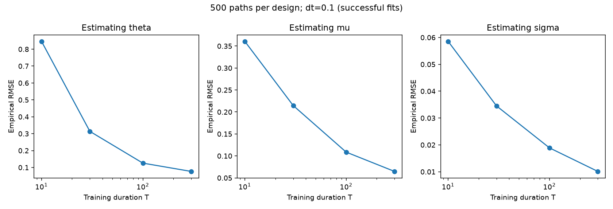
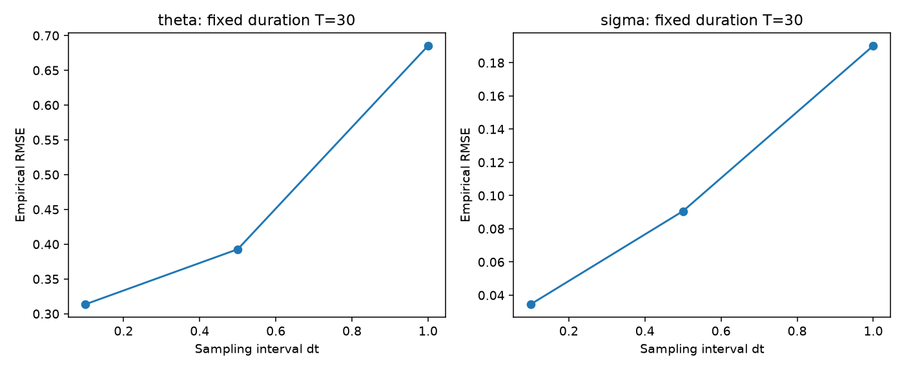
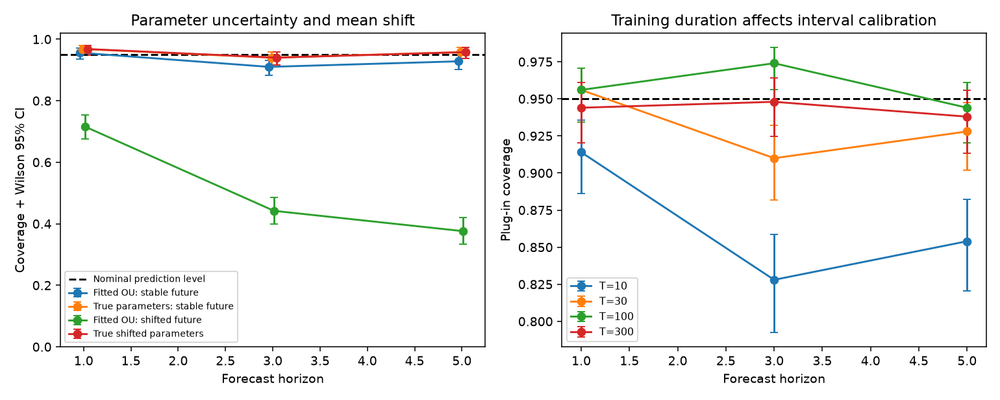
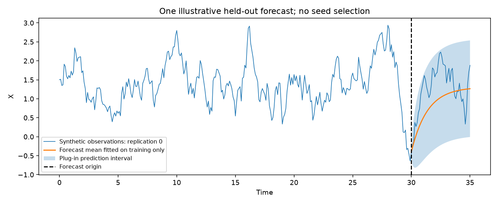

# OU Calibration: Executed Results

All observations are synthetic exact OU transitions. Results below are generated by `run.py`.

Seed: 20261004; 500 independent paths per record-duration design.

## Parameter recovery

Errors below are conditional on successful interior fits. All attempts and failures remain in `replications.csv`.

| T | dt | Successful / attempted | theta RMSE | mu RMSE | sigma RMSE |
| --- | --- | --- | --- | --- | --- |
| 10 | 0.1 | 500 / 500 | 0.84641 | 0.36069 | 0.05856 |
| 30 | 0.1 | 500 / 500 | 0.31366 | 0.21463 | 0.03452 |
| 30 | 0.5 | 500 / 500 | 0.39280 | 0.21412 | 0.09063 |
| 30 | 1.0 | 492 / 500 | 0.68537 | 0.21604 | 0.19024 |
| 100 | 0.1 | 500 / 500 | 0.12574 | 0.10862 | 0.01889 |
| 300 | 0.1 | 500 / 500 | 0.07660 | 0.06469 | 0.01012 |

## Forecast coverage

All methods use the same successful-fit paths. Oracle parameters are a simulation benchmark, not information available to a fitted model.

| T | dt | Horizon | Fitted OU | True parameters | Fitted OU after mean shift | True shifted parameters |
| --- | --- | --- | --- | --- | --- | --- |
| 10 | 0.1 | 1.0 | 0.914 [0.886, 0.936] | 0.964 [0.944, 0.977] | 0.674 [0.632, 0.714] | 0.964 [0.944, 0.977] |
| 10 | 0.1 | 3.0 | 0.828 [0.792, 0.859] | 0.946 [0.923, 0.963] | 0.410 [0.368, 0.454] | 0.946 [0.923, 0.963] |
| 10 | 0.1 | 5.0 | 0.854 [0.820, 0.882] | 0.946 [0.923, 0.963] | 0.336 [0.296, 0.379] | 0.946 [0.923, 0.963] |
| 30 | 0.1 | 1.0 | 0.956 [0.934, 0.971] | 0.968 [0.949, 0.980] | 0.716 [0.675, 0.754] | 0.968 [0.949, 0.980] |
| 30 | 0.1 | 3.0 | 0.910 [0.882, 0.932] | 0.940 [0.916, 0.958] | 0.442 [0.399, 0.486] | 0.940 [0.916, 0.958] |
| 30 | 0.1 | 5.0 | 0.928 [0.902, 0.948] | 0.958 [0.937, 0.972] | 0.376 [0.335, 0.419] | 0.958 [0.937, 0.972] |
| 30 | 0.5 | 1.0 | 0.958 [0.937, 0.972] | 0.968 [0.949, 0.980] | 0.720 [0.679, 0.758] | 0.968 [0.949, 0.980] |
| 30 | 0.5 | 3.0 | 0.906 [0.877, 0.929] | 0.940 [0.916, 0.958] | 0.444 [0.401, 0.488] | 0.940 [0.916, 0.958] |
| 30 | 0.5 | 5.0 | 0.920 [0.893, 0.941] | 0.958 [0.937, 0.972] | 0.376 [0.335, 0.419] | 0.958 [0.937, 0.972] |
| 30 | 1.0 | 1.0 | 0.959 [0.938, 0.974] | 0.970 [0.950, 0.981] | 0.709 [0.668, 0.748] | 0.970 [0.950, 0.981] |
| 30 | 1.0 | 3.0 | 0.911 [0.882, 0.933] | 0.939 [0.914, 0.957] | 0.449 [0.406, 0.493] | 0.939 [0.914, 0.957] |
| 30 | 1.0 | 5.0 | 0.917 [0.889, 0.938] | 0.959 [0.938, 0.974] | 0.380 [0.338, 0.424] | 0.959 [0.938, 0.974] |
| 100 | 0.1 | 1.0 | 0.956 [0.934, 0.971] | 0.954 [0.932, 0.969] | 0.744 [0.704, 0.780] | 0.954 [0.932, 0.969] |
| 100 | 0.1 | 3.0 | 0.974 [0.956, 0.985] | 0.980 [0.964, 0.989] | 0.448 [0.405, 0.492] | 0.980 [0.964, 0.989] |
| 100 | 0.1 | 5.0 | 0.944 [0.920, 0.961] | 0.948 [0.925, 0.964] | 0.394 [0.352, 0.437] | 0.948 [0.925, 0.964] |
| 300 | 0.1 | 1.0 | 0.944 [0.920, 0.961] | 0.952 [0.930, 0.968] | 0.722 [0.681, 0.759] | 0.952 [0.930, 0.968] |
| 300 | 0.1 | 3.0 | 0.948 [0.925, 0.964] | 0.958 [0.937, 0.972] | 0.504 [0.460, 0.548] | 0.958 [0.937, 0.972] |
| 300 | 0.1 | 5.0 | 0.938 [0.913, 0.956] | 0.942 [0.918, 0.959] | 0.430 [0.387, 0.474] | 0.942 [0.918, 0.959] |

Brackets are Wilson 95% intervals for the coverage experiment, not a prediction interval for one future value.

The mean-shift future uses the same innovations as the stable future. Only the equilibrium mean changes at the forecast origin.

## Interpretation and limits

- Longer records provide additional time over which mean reversion can be observed. Dense sampling at fixed duration does not create a longer record.
- Finite-sample conditional likelihood estimates can be biased. Parameter-distribution percentiles in summary.json are not parameter confidence intervals.
- Plug-in prediction intervals exclude uncertainty in estimated parameters. Coverage must be measured rather than assumed.
- A mean shift violates the fitted constant-mean model; the shifted oracle illustrates that lost coverage is model-dependent.
- Replications estimate performance at the specified synthetic settings. These are not observations of SST or evidence that ocean anomalies follow an OU model.
- Forecast horizons within one path are correlated. Coverage intervals are pointwise, with no multiplicity adjustment.

## Figures

## Forecast RMSE versus persistence

Persistence predicts the last training observation at every horizon. Both errors use the same successful-fit paths.

| T | dt | Horizon | Fitted OU RMSE | Persistence RMSE |
| --- | --- | --- | --- | --- |
| 10 | 0.1 | 1.0 | 0.59801 | 0.63860 |
| 10 | 0.1 | 3.0 | 0.75258 | 0.90095 |
| 10 | 0.1 | 5.0 | 0.76234 | 0.94180 |
| 30 | 0.1 | 1.0 | 0.57706 | 0.66305 |
| 30 | 0.1 | 3.0 | 0.70384 | 0.90246 |
| 30 | 0.1 | 5.0 | 0.68393 | 0.91291 |
| 30 | 0.5 | 1.0 | 0.58036 | 0.66305 |
| 30 | 0.5 | 3.0 | 0.70441 | 0.90246 |
| 30 | 0.5 | 5.0 | 0.68603 | 0.91291 |
| 30 | 1.0 | 1.0 | 0.57108 | 0.66220 |
| 30 | 1.0 | 3.0 | 0.71054 | 0.90353 |
| 30 | 1.0 | 5.0 | 0.68410 | 0.91048 |
| 100 | 0.1 | 1.0 | 0.55530 | 0.65274 |
| 100 | 0.1 | 3.0 | 0.63665 | 0.86007 |
| 100 | 0.1 | 5.0 | 0.67874 | 0.91913 |
| 300 | 0.1 | 1.0 | 0.58428 | 0.67349 |
| 300 | 0.1 | 3.0 | 0.66398 | 0.89754 |
| 300 | 0.1 | 5.0 | 0.69835 | 0.91366 |
