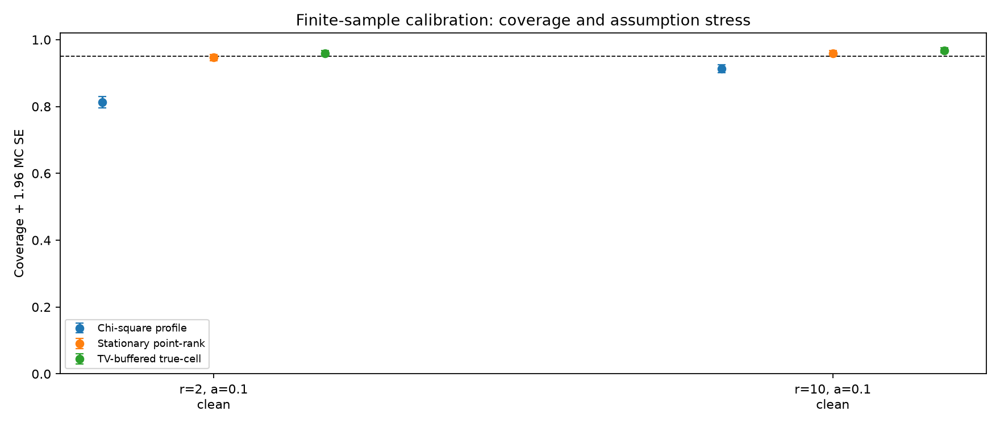

# Executed finite-sample stationary calibration

[Design](../../README.md) · [Proofs](../../../FINITE_SAMPLE_THEORY.md) · [Summary](summary.json) · [Every outer record](replications.csv.gz)

Data seed 20261015; bank seed 20261016; 2000 records per design; B=999.

Coverage here is point-null nonrejection or membership in the true parameter cell. Full continuous inversions are computed only for the saved examples. It is not an empirical width study of full inversions.

| Scenario | Assumptions met? | Profile | Stationary point-rank [Wilson 95%] | MC SE | TV-buffered cell [Wilson 95%] | MC SE | Prior bootstrap-profile (available n) |
| --- | --- | --- | --- | --- | --- | --- | --- |
| r=2,a=0.1,eta=0,start=stationary | True | 0.8135 | 0.9465 [0.9358,0.9555] | 0.0050 | 0.9595 [0.9499,0.9673] | 0.0044 | unavailable (n=0) |
| r=10,a=0.1,eta=0,start=stationary | True | 0.9130 | 0.9590 [0.9494,0.9668] | 0.0044 | 0.9680 [0.9593,0.9749] | 0.0039 | unavailable (n=0) |

The prior bootstrap values use audited matched records when available. They are conditional on an interior generating fit; the new methods retain every nondegenerate record. A changed data seed or reduced run has no matched archived bootstrap baseline.

## Paired improvements over chi-square-profile

| Scenario | Point-rank minus profile (MC SE) | Buffered-cell minus profile (MC SE) | TV margin | Effective alpha |
| --- | --- | --- | --- | --- |
| r=2,a=0.1,eta=0,start=stationary | 0.1330 (0.0076) | 0.1460 (0.0079) | 0.0135 | 0.0365 |
| r=10,a=0.1,eta=0,start=stationary | 0.0460 (0.0047) | 0.0550 (0.0051) | 0.0135 | 0.0365 |

## Two illustrative power points in the central clean design

- r=10,a=0.1,eta=0,start=stationary: reject false theta=0.5×truth **0.1500**, MC SE **0.0080**; theta=2×truth **0.2235**, MC SE **0.0093**.

Power is measured for point-null tests, not the more conservative full cell envelope.

## Predetermined full inversions

[Every grid decision and raw example series](examples.json). Replication zero is fixed before execution; examples are not selected for narrow sets.

No full inversion examples were requested for this run; examples.json is an empty list.

## Figures

## Interpretation and limitations

- The proof gives a coverage lower bound under stationary noise-free Gaussian OU, over data and simulation randomness. It does not guarantee conditional coverage at a fixed X0.
- Stress cases violate assumptions. Whether a particular stress run has high or low coverage does not extend the theorem.
- Buffered sets trade power and precision for a bound on cell discretization. They can be disconnected; their enclosing hull always reaches zero because the final tail is included.
- Independent banks per outer record support the reported MC SEs. Main data reuse is explicit; confirmation is separate and is not pooled.
- Existing Monte Carlo rank-test theory and Pinsker bounds are credited. Novelty of the OU specialization is not established.
- Proofs assume exact draws/arithmetic; this floating-point implementation is checked numerically but is not a universal rounding certificate.
