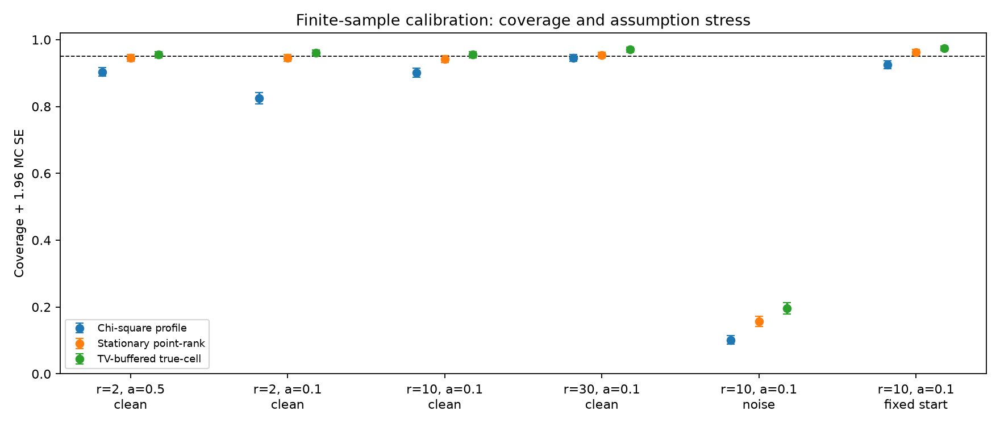
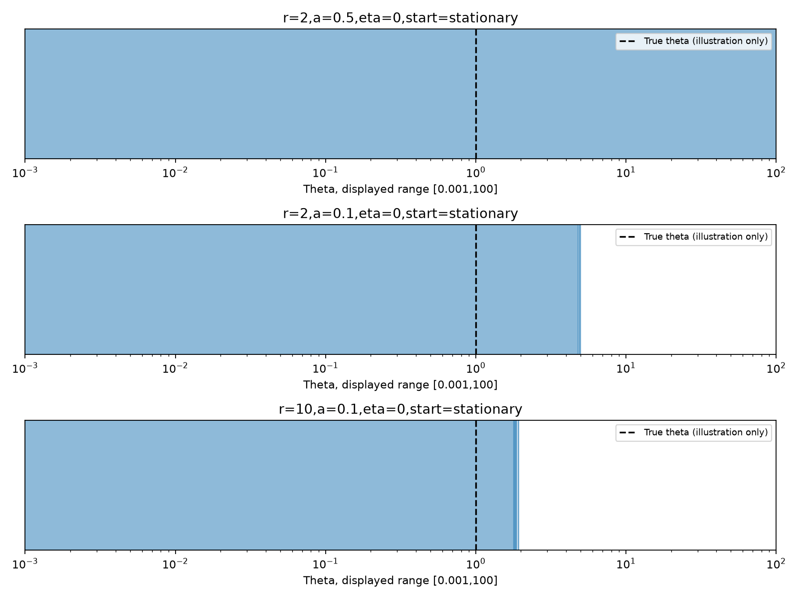

# Executed finite-sample stationary calibration

[Design](../../README.md) · [Proofs](../../../FINITE_SAMPLE_THEORY.md) · [Summary](summary.json) · [Every outer record](replications.csv.gz)

Data seed 20261010; bank seed 20261014; 2000 records per design; B=399.

Coverage here is point-null nonrejection or membership in the true parameter cell. Full continuous inversions are computed only for the saved examples. It is not an empirical width study of full inversions.

| Scenario | Assumptions met? | Profile | Stationary point-rank [Wilson 95%] | MC SE | TV-buffered cell [Wilson 95%] | MC SE | Prior bootstrap-profile (available n) |
| --- | --- | --- | --- | --- | --- | --- | --- |
| r=2,a=0.5,eta=0,start=stationary | True | 0.9035 | 0.9455 [0.9347,0.9546] | 0.0051 | 0.9550 [0.9450,0.9632] | 0.0046 | 0.9787 (n=893) |
| r=2,a=0.1,eta=0,start=stationary | True | 0.8245 | 0.9460 [0.9352,0.9551] | 0.0051 | 0.9605 [0.9510,0.9682] | 0.0044 | 0.8569 (n=1957) |
| r=10,a=0.1,eta=0,start=stationary | True | 0.9010 | 0.9425 [0.9314,0.9519] | 0.0052 | 0.9550 [0.9450,0.9632] | 0.0046 | 0.9200 (n=2000) |
| r=30,a=0.1,eta=0,start=stationary | True | 0.9450 | 0.9540 [0.9439,0.9623] | 0.0047 | 0.9705 [0.9621,0.9771] | 0.0038 | 0.9520 (n=2000) |
| r=10,a=0.1,eta=0.5,start=stationary | False | 0.1015 | 0.1570 [0.1417,0.1736] | 0.0081 | 0.1960 [0.1792,0.2140] | 0.0089 | 0.1210 (n=2000) |
| r=10,a=0.1,eta=0,start=fixed5 | False | 0.9255 | 0.9630 [0.9538,0.9704] | 0.0042 | 0.9740 [0.9661,0.9801] | 0.0036 | unavailable (n=0) |

The prior bootstrap values use audited matched records when available. They are conditional on an interior generating fit; the new methods retain every nondegenerate record. A changed data seed or reduced run has no matched archived bootstrap baseline.

## Paired improvements over chi-square-profile

| Scenario | Point-rank minus profile (MC SE) | Buffered-cell minus profile (MC SE) | TV margin | Effective alpha |
| --- | --- | --- | --- | --- |
| r=2,a=0.5,eta=0,start=stationary | 0.0420 (0.0045) | 0.0515 (0.0049) | 0.0117 | 0.0383 |
| r=2,a=0.1,eta=0,start=stationary | 0.1215 (0.0073) | 0.1360 (0.0077) | 0.0135 | 0.0365 |
| r=10,a=0.1,eta=0,start=stationary | 0.0415 (0.0045) | 0.0540 (0.0051) | 0.0135 | 0.0365 |
| r=30,a=0.1,eta=0,start=stationary | 0.0090 (0.0022) | 0.0255 (0.0035) | 0.0135 | 0.0365 |
| r=10,a=0.1,eta=0.5,start=stationary | 0.0555 (0.0051) | 0.0945 (0.0065) | 0.0135 | 0.0365 |
| r=10,a=0.1,eta=0,start=fixed5 | 0.0375 (0.0042) | 0.0485 (0.0048) | 0.0135 | 0.0365 |

## Two illustrative power points in the central clean design

- r=10,a=0.1,eta=0,start=stationary: reject false theta=0.5×truth **0.1725**, MC SE **0.0084**; theta=2×truth **0.2155**, MC SE **0.0092**.

Power is measured for point-null tests, not the more conservative full cell envelope.

## Predetermined full inversions

[Every grid decision and raw example series](examples.json). Replication zero is fixed before execution; examples are not selected for narrow sets.

- r=2,a=0.5,eta=0,start=stationary: **251** cells; **1** connected components; conservative hull **[0.0000, infinity]**. The phi-to-one tail is retained without testing.
- r=2,a=0.1,eta=0,start=stationary: **561** cells; **2** connected components; conservative hull **[0.0000, 4.9798]**. The phi-to-one tail is retained without testing.
- r=10,a=0.1,eta=0,start=stationary: **1251** cells; **4** connected components; conservative hull **[0.0000, 1.9403]**. The phi-to-one tail is retained without testing.

## Figures

The display is restricted to theta in [0.001,100]; the actual saved sets retain the full zero-limit tail and any infinite upper endpoint.

## Interpretation and limitations

- The proof gives a coverage lower bound under stationary noise-free Gaussian OU, over data and simulation randomness. It does not guarantee conditional coverage at a fixed X0.
- Stress cases violate assumptions. Whether a particular stress run has high or low coverage does not extend the theorem.
- Buffered sets trade power and precision for a bound on cell discretization. They can be disconnected; their enclosing hull always reaches zero because the final tail is included.
- Independent banks per outer record support the reported MC SEs. Main data reuse is explicit; confirmation is separate and is not pooled.
- Existing Monte Carlo rank-test theory and Pinsker bounds are credited. Novelty of the OU specialization is not established.
- Proofs assume exact draws/arithmetic; this floating-point implementation is checked numerically but is not a universal rounding certificate.
