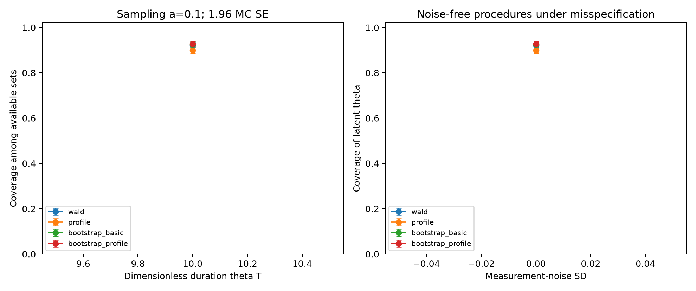
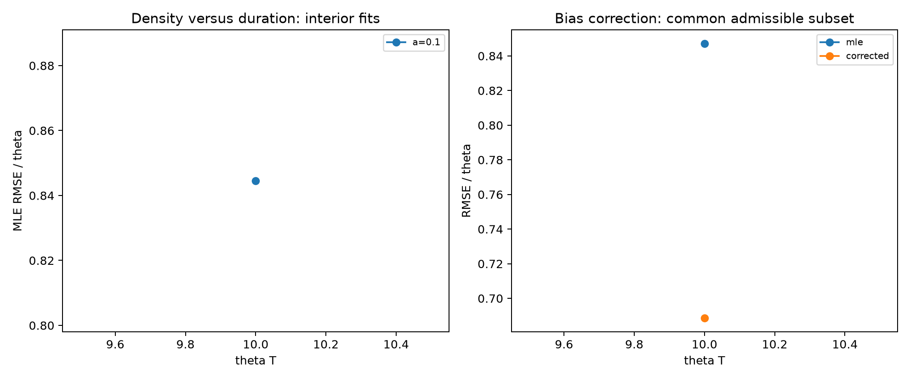

# OU uncertainty: executed benchmark

[Protocol](../../PROTOCOL.md) · [Derivations](../../THEORY.md) · [All attempts](replications.csv.gz) · [Full summary](summary.json)

Seed **20261011**; **2,000** outer paths per scenario; **B=999**. All data are synthetic.

## Point estimation

Bias/RMSE are conditional on admissibility. The two common-subset RMSEs use exactly the same records. Their denominator can differ from the MLE total.

| Scenario | Interior / attempted | MLE bias (MC SE) | MLE RMSE (MC SE) | Correction valid | Common MLE / corrected RMSE |
| --- | --- | --- | --- | --- | --- |
| r=10,a=0.1,eta=0 | 2000 / 2000 | 0.4917 (0.0154) | 0.8445 (0.0202) | 1976 | 0.8471 / 0.6887 (n=1976) |

### Paired squared-error change under slope correction

Corrected minus MLE MSE on the common admissible subset; negative differences favor correction. Availability is still reported separately.

| Scenario | Common n | Paired MSE change | Paired MC SE |
| --- | --- | --- | --- |
| r=10,a=0.1,eta=0 | 1976 | -0.2432 | 0.0131 |

## Confidence sets

Conditional coverage uses available sets. Success-and-coverage uses all attempts, counting an unavailable procedure as unsuccessful. Empty sets remain available with coverage zero. Finite widths exclude empty/unbounded sets and have an explicit denominator.

| Scenario | Method | Available | Conditional coverage [Wilson 95%] | MC SE | Success-and-coverage | Empty / unbounded | Finite mean width (n) |
| --- | --- | --- | --- | --- | --- | --- | --- |
| r=10,a=0.1,eta=0 | wald | 2000/2000 | 0.9220 [0.9094, 0.9330] | 0.0060 | 0.9220 | 0 / 0 | 2.2598 (n=2000) |
| r=10,a=0.1,eta=0 | profile | 2000/2000 | 0.8995 [0.8855, 0.9119] | 0.0067 | 0.8995 | 0 / 0 | 2.2974 (n=2000) |
| r=10,a=0.1,eta=0 | bootstrap_basic | 2000/2000 | 0.9250 [0.9126, 0.9357] | 0.0059 | 0.9250 | 0 / 0 | 2.0793 (n=2000) |
| r=10,a=0.1,eta=0 | bootstrap_profile | 2000/2000 | 0.9275 [0.9153, 0.9381] | 0.0058 | 0.9275 | 0 / 0 | 2.5155 (n=2000) |

## Paired bootstrap-profile minus chi-square-profile coverage

Same available records; differences and MC SE account for pairing. These descriptive comparisons are not multiplicity-adjusted superiority tests.

| Scenario | Common n | Coverage difference | Paired MC SE | All-attempt joint-success difference |
| --- | --- | --- | --- | --- |
| r=10,a=0.1,eta=0 | 2000 | 0.0280 | 0.0038 | 0.0280 |

## Paired sampling-density comparisons

Negative squared-error differences favor the fine grid. Fits must be admissible on both grids.

| theta T | Fine a | Coarse a | Common n | MSE fine - coarse | Paired MC SE |
| --- | --- | --- | --- | --- | --- |

## Observation-noise benchmark

| Noise SD | True theta | Expanding-domain pseudo-theta | Recorded MLE mean |
| --- | --- | --- | --- |

Pseudo-theta is a long-record limit of the misspecified regression, not a finite-sample target or replacement truth.

## Figures

[Vector coverage figure](coverage_and_noise.pdf) · [Vector estimation figure](drift_estimation.pdf)

## Limitations and reproducibility

- This benchmarks established methods; it does not establish a new estimator or a publication-ready contribution.
- Coverage is not guaranteed by the use of a chi-square quantile or bootstrap. Unavailable fits and corrected estimates are retained.
- Interval endpoints at zero and infinity denote closures of the physical domain. CSV uses inf for infinite upper limits; JSON reports unbounded-set counts and flags without a finite surrogate width.
- Noise stress cases deliberately fit the wrong observation model. No noise-aware state-space inference is implemented here.
- The confirmation run uses a new seed and larger B, jointly; it cannot isolate either factor. Main/confirmation results are not pooled.
- All bootstrap slopes, including inadmissible ones, are used for the calculations. The archive saves their counts and means per outer record; full inner paths are regenerated from the seed scheme.
- Code/configuration/protocol SHA256 hashes and software versions are in summary.json. Runtime is machine-dependent.
