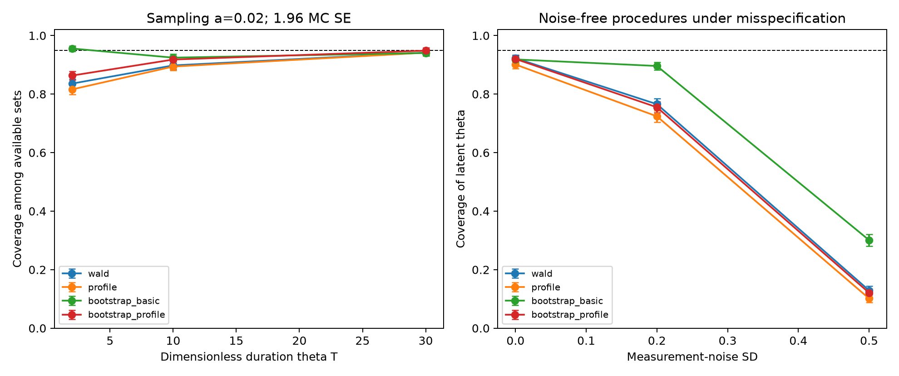
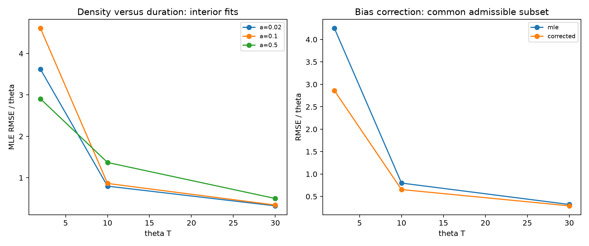

# OU uncertainty: executed benchmark

[Protocol](../../PROTOCOL.md) · [Derivations](../../THEORY.md) · [All attempts](replications.csv.gz) · [Full summary](summary.json)

Seed **20261010**; **2,000** outer paths per scenario; **B=399**. All data are synthetic.

## Point estimation

Bias/RMSE are conditional on admissibility. The two common-subset RMSEs use exactly the same records. Their denominator can differ from the MLE total.

| Scenario | Interior / attempted | MLE bias (MC SE) | MLE RMSE (MC SE) | Correction valid | Common MLE / corrected RMSE |
| --- | --- | --- | --- | --- | --- |
| r=2,a=0.02,eta=0 | 1961 / 2000 | 2.6030 (0.0569) | 3.6210 (0.0830) | 1412 | 4.2496 / 2.8604 (n=1412) |
| r=2,a=0.1,eta=0 | 1957 / 2000 | 3.0673 (0.0777) | 4.6078 (0.1385) | 1499 | 5.2564 / 3.7385 (n=1499) |
| r=2,a=0.5,eta=0 | 893 / 2000 | 1.8705 (0.0745) | 2.9059 (0.0964) | 771 | 3.1201 / 1.5677 (n=771) |
| r=10,a=0.02,eta=0 | 2000 / 2000 | 0.4664 (0.0145) | 0.7976 (0.0177) | 1981 | 0.7990 / 0.6547 (n=1981) |
| r=10,a=0.1,eta=0 | 2000 / 2000 | 0.5022 (0.0157) | 0.8628 (0.0202) | 1978 | 0.8651 / 0.7051 (n=1978) |
| r=10,a=0.5,eta=0 | 1952 / 2000 | 0.7119 (0.0265) | 1.3688 (0.0475) | 1918 | 1.3775 / 0.9885 (n=1918) |
| r=10,a=0.1,eta=0.2 | 2000 / 2000 | 1.0755 (0.0215) | 1.4436 (0.0291) | 1995 | 1.4451 / 1.1601 (n=1995) |
| r=10,a=0.1,eta=0.5 | 2000 / 2000 | 3.6429 (0.0469) | 4.2043 (0.0674) | 2000 | 4.2043 / 3.7978 (n=2000) |
| r=30,a=0.02,eta=0 | 2000 / 2000 | 0.1415 (0.0065) | 0.3222 (0.0068) | 2000 | 0.3222 / 0.2915 (n=2000) |
| r=30,a=0.1,eta=0 | 2000 / 2000 | 0.1496 (0.0069) | 0.3412 (0.0080) | 2000 | 0.3412 / 0.3076 (n=2000) |
| r=30,a=0.5,eta=0 | 2000 / 2000 | 0.2156 (0.0101) | 0.4997 (0.0141) | 2000 | 0.4997 / 0.4426 (n=2000) |

### Paired squared-error change under slope correction

Corrected minus MLE MSE on the common admissible subset; negative differences favor correction. Availability is still reported separately.

| Scenario | Common n | Paired MSE change | Paired MC SE |
| --- | --- | --- | --- |
| r=2,a=0.02,eta=0 | 1412 | -9.8776 | 0.2577 |
| r=2,a=0.1,eta=0 | 1499 | -13.6526 | 0.6306 |
| r=2,a=0.5,eta=0 | 771 | -7.2775 | 0.5445 |
| r=10,a=0.02,eta=0 | 1981 | -0.2098 | 0.0122 |
| r=10,a=0.1,eta=0 | 1978 | -0.2512 | 0.0135 |
| r=10,a=0.5,eta=0 | 1918 | -0.9206 | 0.0806 |
| r=10,a=0.1,eta=0.2 | 1995 | -0.7424 | 0.0193 |
| r=10,a=0.1,eta=0.5 | 2000 | -3.2526 | 0.0633 |
| r=30,a=0.02,eta=0 | 2000 | -0.0188 | 0.0018 |
| r=30,a=0.1,eta=0 | 2000 | -0.0218 | 0.0019 |
| r=30,a=0.5,eta=0 | 2000 | -0.0538 | 0.0038 |

## Confidence sets

Conditional coverage uses available sets. Success-and-coverage uses all attempts, counting an unavailable procedure as unsuccessful. Empty sets remain available with coverage zero. Finite widths exclude empty/unbounded sets and have an explicit denominator.

| Scenario | Method | Available | Conditional coverage [Wilson 95%] | MC SE | Success-and-coverage | Empty / unbounded | Finite mean width (n) |
| --- | --- | --- | --- | --- | --- | --- | --- |
| r=2,a=0.02,eta=0 | wald | 1961/2000 | 0.8358 [0.8187, 0.8515] | 0.0084 | 0.8195 | 0 / 0 | 6.8227 (n=1961) |
| r=2,a=0.02,eta=0 | profile | 2000/2000 | 0.8160 [0.7984, 0.8324] | 0.0087 | 0.8160 | 0 / 0 | 6.8563 (n=2000) |
| r=2,a=0.02,eta=0 | bootstrap_basic | 1961/2000 | 0.9556 [0.9456, 0.9639] | 0.0046 | 0.9370 | 0 / 0 | 5.3069 (n=1961) |
| r=2,a=0.02,eta=0 | bootstrap_profile | 1961/2000 | 0.8633 [0.8474, 0.8778] | 0.0078 | 0.8465 | 0 / 0 | 7.7767 (n=1961) |
| r=2,a=0.1,eta=0 | wald | 1957/2000 | 0.9836 [0.9770, 0.9884] | 0.0029 | 0.9625 | 0 / 0 | 9.2274 (n=1957) |
| r=2,a=0.1,eta=0 | profile | 2000/2000 | 0.8245 [0.8072, 0.8405] | 0.0085 | 0.8245 | 0 / 161 | 9.7395 (n=1839) |
| r=2,a=0.1,eta=0 | bootstrap_basic | 1957/2000 | 0.9034 [0.8895, 0.9157] | 0.0067 | 0.8840 | 0 / 55 | 6.8946 (n=1902) |
| r=2,a=0.1,eta=0 | bootstrap_profile | 1957/2000 | 0.8569 [0.8407, 0.8717] | 0.0079 | 0.8385 | 0 / 187 | 11.3992 (n=1770) |
| r=2,a=0.5,eta=0 | wald | 893/2000 | 0.9686 [0.9551, 0.9782] | 0.0058 | 0.4325 | 0 / 0 | 22.8732 (n=893) |
| r=2,a=0.5,eta=0 | profile | 2000/2000 | 0.9035 [0.8898, 0.9157] | 0.0066 | 0.9035 | 0 / 1843 | 3.3922 (n=157) |
| r=2,a=0.5,eta=0 | bootstrap_basic | 893/2000 | 0.9015 [0.8802, 0.9193] | 0.0100 | 0.4025 | 0 / 738 | 3.8893 (n=155) |
| r=2,a=0.5,eta=0 | bootstrap_profile | 893/2000 | 0.9787 [0.9670, 0.9863] | 0.0048 | 0.4370 | 0 / 867 | 3.7650 (n=26) |
| r=10,a=0.02,eta=0 | wald | 2000/2000 | 0.8980 [0.8840, 0.9105] | 0.0068 | 0.8980 | 0 / 0 | 2.1019 (n=2000) |
| r=10,a=0.02,eta=0 | profile | 2000/2000 | 0.8940 [0.8797, 0.9067] | 0.0069 | 0.8940 | 0 / 0 | 2.1069 (n=2000) |
| r=10,a=0.02,eta=0 | bootstrap_basic | 2000/2000 | 0.9245 [0.9121, 0.9353] | 0.0059 | 0.9245 | 0 / 0 | 1.9820 (n=2000) |
| r=10,a=0.02,eta=0 | bootstrap_profile | 2000/2000 | 0.9180 [0.9052, 0.9292] | 0.0061 | 0.9180 | 0 / 0 | 2.3048 (n=2000) |
| r=10,a=0.1,eta=0 | wald | 2000/2000 | 0.9225 [0.9100, 0.9334] | 0.0060 | 0.9225 | 0 / 0 | 2.2733 (n=2000) |
| r=10,a=0.1,eta=0 | profile | 2000/2000 | 0.9010 [0.8871, 0.9133] | 0.0067 | 0.9010 | 0 / 0 | 2.3117 (n=2000) |
| r=10,a=0.1,eta=0 | bootstrap_basic | 2000/2000 | 0.9185 [0.9057, 0.9297] | 0.0061 | 0.9185 | 0 / 0 | 2.0765 (n=2000) |
| r=10,a=0.1,eta=0 | bootstrap_profile | 2000/2000 | 0.9200 [0.9073, 0.9311] | 0.0061 | 0.9200 | 0 / 0 | 2.5214 (n=2000) |
| r=10,a=0.5,eta=0 | wald | 1952/2000 | 0.9892 [0.9836, 0.9930] | 0.0023 | 0.9655 | 0 / 0 | 4.3298 (n=1952) |
| r=10,a=0.5,eta=0 | profile | 2000/2000 | 0.9080 [0.8945, 0.9199] | 0.0065 | 0.9080 | 0 / 738 | 3.5201 (n=1262) |
| r=10,a=0.5,eta=0 | bootstrap_basic | 1952/2000 | 0.8786 [0.8633, 0.8923] | 0.0074 | 0.8575 | 0 / 359 | 2.5964 (n=1593) |
| r=10,a=0.5,eta=0 | bootstrap_profile | 1952/2000 | 0.8934 [0.8790, 0.9064] | 0.0070 | 0.8720 | 0 / 783 | 3.8802 (n=1169) |
| r=10,a=0.1,eta=0.2 | wald | 2000/2000 | 0.7655 [0.7464, 0.7835] | 0.0095 | 0.7655 | 0 / 0 | 2.7806 (n=2000) |
| r=10,a=0.1,eta=0.2 | profile | 2000/2000 | 0.7240 [0.7040, 0.7431] | 0.0100 | 0.7240 | 0 / 0 | 2.8325 (n=2000) |
| r=10,a=0.1,eta=0.2 | bootstrap_basic | 2000/2000 | 0.8960 [0.8819, 0.9086] | 0.0068 | 0.8960 | 0 / 0 | 2.6873 (n=2000) |
| r=10,a=0.1,eta=0.2 | bootstrap_profile | 2000/2000 | 0.7550 [0.7357, 0.7733] | 0.0096 | 0.7550 | 0 / 0 | 3.0380 (n=2000) |
| r=10,a=0.1,eta=0.5 | wald | 2000/2000 | 0.1290 [0.1150, 0.1444] | 0.0075 | 0.1290 | 0 / 0 | 4.9426 (n=2000) |
| r=10,a=0.1,eta=0.5 | profile | 2000/2000 | 0.1015 [0.0890, 0.1155] | 0.0068 | 0.1015 | 0 / 4 | 5.1140 (n=1996) |
| r=10,a=0.1,eta=0.5 | bootstrap_basic | 2000/2000 | 0.3010 [0.2813, 0.3215] | 0.0103 | 0.3010 | 0 / 1 | 4.8576 (n=1999) |
| r=10,a=0.1,eta=0.5 | bootstrap_profile | 2000/2000 | 0.1210 [0.1074, 0.1360] | 0.0073 | 0.1210 | 0 / 3 | 5.3092 (n=1997) |
| r=30,a=0.02,eta=0 | wald | 2000/2000 | 0.9420 [0.9309, 0.9514] | 0.0052 | 0.9420 | 0 / 0 | 1.0861 (n=2000) |
| r=30,a=0.02,eta=0 | profile | 2000/2000 | 0.9415 [0.9303, 0.9510] | 0.0052 | 0.9415 | 0 / 0 | 1.0868 (n=2000) |
| r=30,a=0.02,eta=0 | bootstrap_basic | 2000/2000 | 0.9405 [0.9293, 0.9500] | 0.0053 | 0.9405 | 0 / 0 | 1.1761 (n=2000) |
| r=30,a=0.02,eta=0 | bootstrap_profile | 2000/2000 | 0.9485 [0.9379, 0.9574] | 0.0049 | 0.9485 | 0 / 0 | 1.1377 (n=2000) |
| r=30,a=0.1,eta=0 | wald | 2000/2000 | 0.9490 [0.9385, 0.9578] | 0.0049 | 0.9490 | 0 / 0 | 1.1439 (n=2000) |
| r=30,a=0.1,eta=0 | profile | 2000/2000 | 0.9450 [0.9341, 0.9542] | 0.0051 | 0.9450 | 0 / 0 | 1.1489 (n=2000) |
| r=30,a=0.1,eta=0 | bootstrap_basic | 2000/2000 | 0.9355 [0.9239, 0.9455] | 0.0055 | 0.9355 | 0 / 0 | 1.2066 (n=2000) |
| r=30,a=0.1,eta=0 | bootstrap_profile | 2000/2000 | 0.9520 [0.9417, 0.9605] | 0.0048 | 0.9520 | 0 / 0 | 1.2027 (n=2000) |
| r=30,a=0.5,eta=0 | wald | 2000/2000 | 0.9860 [0.9798, 0.9903] | 0.0026 | 0.9860 | 0 / 0 | 1.6002 (n=2000) |
| r=30,a=0.5,eta=0 | profile | 2000/2000 | 0.9375 [0.9260, 0.9473] | 0.0054 | 0.9375 | 0 / 21 | 1.7463 (n=1979) |
| r=30,a=0.5,eta=0 | bootstrap_basic | 2000/2000 | 0.9085 [0.8951, 0.9204] | 0.0064 | 0.9085 | 0 / 8 | 1.5460 (n=1992) |
| r=30,a=0.5,eta=0 | bootstrap_profile | 2000/2000 | 0.9440 [0.9330, 0.9533] | 0.0051 | 0.9440 | 0 / 21 | 1.8224 (n=1979) |

## Paired bootstrap-profile minus chi-square-profile coverage

Same available records; differences and MC SE account for pairing. These descriptive comparisons are not multiplicity-adjusted superiority tests.

| Scenario | Common n | Coverage difference | Paired MC SE | All-attempt joint-success difference |
| --- | --- | --- | --- | --- |
| r=2,a=0.02,eta=0 | 1961 | 0.0505 | 0.0049 | 0.0305 |
| r=2,a=0.1,eta=0 | 1957 | 0.0342 | 0.0041 | 0.0140 |
| r=2,a=0.5,eta=0 | 893 | 0.0392 | 0.0082 | -0.4665 |
| r=10,a=0.02,eta=0 | 2000 | 0.0240 | 0.0035 | 0.0240 |
| r=10,a=0.1,eta=0 | 2000 | 0.0190 | 0.0031 | 0.0190 |
| r=10,a=0.5,eta=0 | 1952 | -0.0369 | 0.0047 | -0.0360 |
| r=10,a=0.1,eta=0.2 | 2000 | 0.0310 | 0.0041 | 0.0310 |
| r=10,a=0.1,eta=0.5 | 2000 | 0.0195 | 0.0033 | 0.0195 |
| r=30,a=0.02,eta=0 | 2000 | 0.0070 | 0.0026 | 0.0070 |
| r=30,a=0.1,eta=0 | 2000 | 0.0070 | 0.0022 | 0.0070 |
| r=30,a=0.5,eta=0 | 2000 | 0.0065 | 0.0024 | 0.0065 |

## Paired sampling-density comparisons

Negative squared-error differences favor the fine grid. Fits must be admissible on both grids.

| theta T | Fine a | Coarse a | Common n | MSE fine - coarse | Paired MC SE |
| --- | --- | --- | --- | --- | --- |
| 2.0 | 0.02 | 0.1 | 1944 | -8.5430 | 0.9960 |
| 2.0 | 0.02 | 0.5 | 879 | 1.3275 | 0.9028 |
| 10.0 | 0.02 | 0.1 | 2000 | -0.1084 | 0.0150 |
| 10.0 | 0.02 | 0.5 | 1952 | -1.2928 | 0.1226 |
| 30.0 | 0.02 | 0.1 | 2000 | -0.0126 | 0.0020 |
| 30.0 | 0.02 | 0.5 | 2000 | -0.1459 | 0.0121 |

## Observation-noise benchmark

| Noise SD | True theta | Expanding-domain pseudo-theta | Recorded MLE mean |
| --- | --- | --- | --- |
| 0.2 | 1.0 | 1.3922 | 2.0755 |
| 0.5 | 1.0 | 3.2314 | 4.6429 |

Pseudo-theta is a long-record limit of the misspecified regression, not a finite-sample target or replacement truth.

## Figures

[Vector coverage figure](coverage_and_noise.pdf) · [Vector estimation figure](drift_estimation.pdf)

## Limitations and reproducibility

- This benchmarks established methods; it does not establish a new estimator or a publication-ready contribution.
- Coverage is not guaranteed by the use of a chi-square quantile or bootstrap. Unavailable fits and corrected estimates are retained.
- Interval endpoints at zero and infinity denote closures of the physical domain. CSV uses inf for infinite upper limits; JSON reports unbounded-set counts and flags without a finite surrogate width.
- Noise stress cases deliberately fit the wrong observation model. No noise-aware state-space inference is implemented here.
- The confirmation run uses a new seed and larger B, jointly; it cannot isolate either factor. Main/confirmation results are not pooled.
- All bootstrap slopes, including inadmissible ones, are used for the calculations. The archive saves their counts and means per outer record; full inner paths are regenerated from the seed scheme.
- Code/configuration/protocol SHA256 hashes and software versions are in summary.json. Runtime is machine-dependent.
